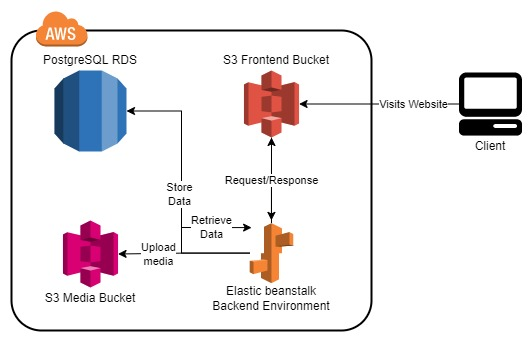

# Project Infrastructure
Udagram consists of several parts that integrate together in a specific way in order to serve the final production website.

## Diagram
The following is a rough representation of all the high-level flow of the application.

## AWS Provisioning
The project mostly uses AWS services in order to get published.

The services (and their instances) used are as follows:

* **S3 Website Bucket** is used to host the frontend of the application with all its static files (HTML, CSS, JS bundles, and images).  It acts as the interface between the application's API and the end-user.

* **Elastic beanstalk** is used to host the application's backend providing it wih the Environment variables for the database credentials and media bucket name.

* **S3 Media Bucket** is used to host the media uploaded by the users using the frontend of the application.

* **RDS PostgreSQL Instance** is used to store all tabular data about the users, their feeds, and the URLs of their feeds.

## Application flow
The application works exactly as shown in the diagram.
1. The user can visit the website and get the User Interface as a response.
2. The UI communicates the user's actions to the backend with the REST APIs provided by the backend.
3. The backend uploads the provided media to the S3 bucket created for so. The backend also communicates the provided and the required data to/from the PostgreSQL database.

