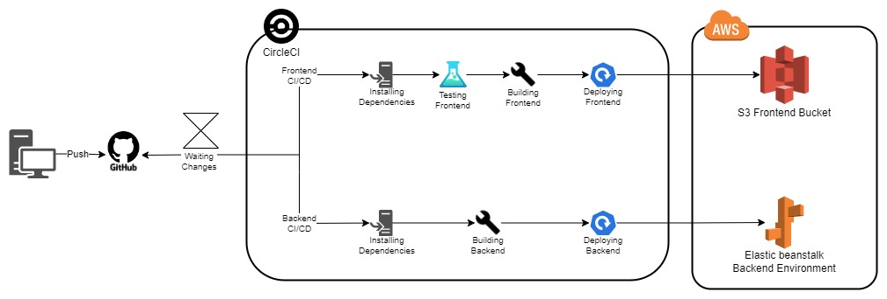

# Pipeline process
Udagram uses a CI/CD practice using CircleCI in order to automate the testing, building, and deployment process.

## Diagram
The following is a rough representation of all the pipeline process.

## Pipeline Flow
The pipeline process starts on every github push to the application's github repository. Once a new source code gets pushed to github, the pipeline starts its workflow as follows with two jobs running in parallel.

### **Frontend Build, and Deploy job**
In this job, only the AWS S3 bucket gets involved after running the following scripts in order:

1. Installing the frontend dependencies.
2. Testing the frontend application.
3. Building the frontend to a minimized bundles of codes.
4. Deploying the frontend to AWS S3 using AWS CLI.

### **Backend Build, and Deploy job**
In this job, only the AWS Elastic beanstalk gets involved after running the following scripts in order:

1. Installing the backend dependencies.
2. Building the backend, which involves transpiling the typescript source code into a javascript one.
3. Deploying the backend to AWS EB using EB CLI. In this process, an EB is initialized in the built directory "*www*". Then it gets deployed to the required EB Environment.

